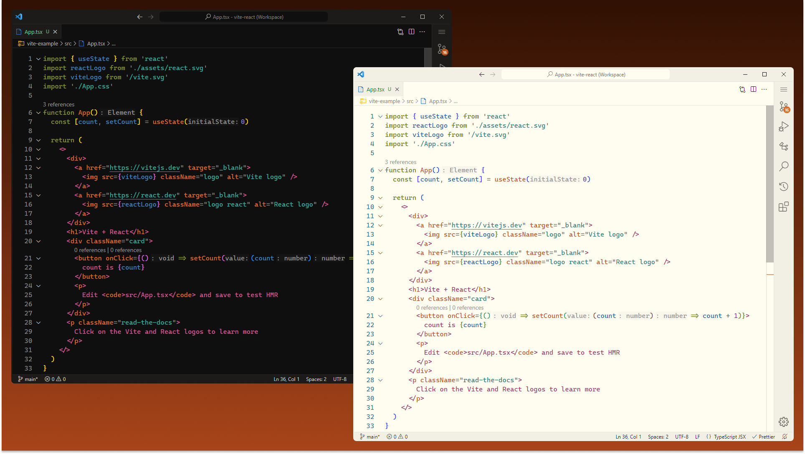
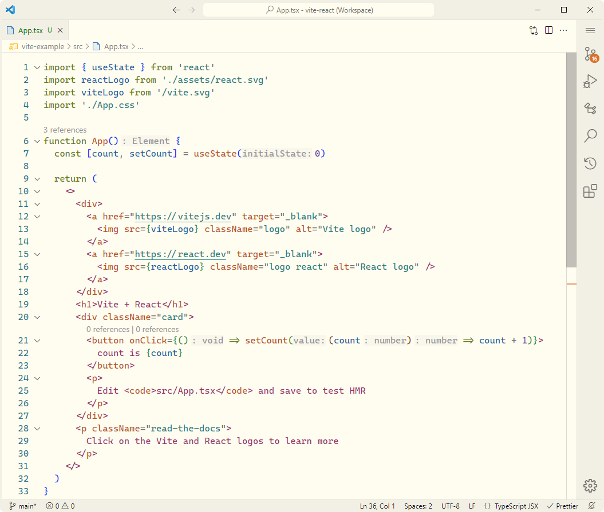

# [Flexoki Theme](https://marketplace.visualstudio.com/items?itemName=mthierman.theme-flexoki) for VS Code & Windows Terminal

## VS Code themes based on [Flexoki](https://stephango.com/flexoki) by [Steph Ango](https://stephango.com/)

### Dark & light themes for VS Code & Windows terminal. VS Code themes include choice of accent color.

> "Flexoki is an inky color scheme for prose and code. Flexoki is designed for reading and writing on digital screens. It is inspired by analog printing inks and warm shades of paper.
>
> Flexoki is minimalistic and high-contrast. The colors are calibrated for legibility and perceptual balance across devices and when switching between light and dark modes."
>
> -   Steph Ango

## Screenshots

## Other resources:

-   [Flexoki GitHub](https://github.com/kepano/flexoki)
-   [Flexoki Figma](https://www.figma.com/community/file/1293274371462921490/flexoki)
